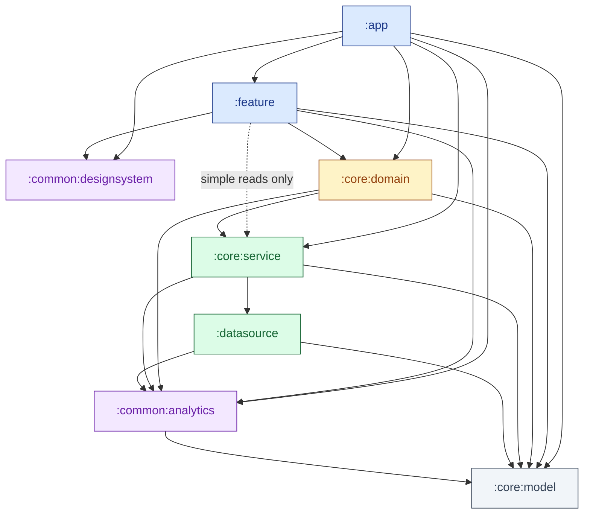

# Module dependency graph

Generated from each module's `build.gradle.kts` as of 2026-04-21. Re-generate whenever dependency edges change.

## Graph

색상 범례:

- 파랑 — UI 계층 (`:app`, `:feature`)
- 노랑 — 도메인 계층 (`:core:domain`)
- 초록 — 데이터 계층 (`:core:service`, `:datasource`)
- 보라 — 공통 모듈 (`:common:designsystem`, `:common:analytics`)
- 회색 — pure Kotlin (`:core:model`)

점선 (`:feature --> :core:service`) 은 **Gradle 이 강제하지 않는 관례적 제한** — 단순 read-only 질의에만 허용, 비즈니스 로직은 `:core:domain` UseCase 경유.

## Direct dependencies (source of truth)

| Module | Depends on |
|---|---|
| `:app` | `:feature`, `:core:domain`, `:core:service`, `:core:model`, `:common:designsystem`, `:common:analytics` |
| `:feature` | `:core:domain`, `:core:service` ★, `:core:model`, `:common:designsystem`, `:common:analytics` |
| `:core:domain` | `:core:service`, `:core:model`, `:common:analytics` |
| `:core:service` | `:datasource`, `:core:model`, `:common:analytics` |
| `:datasource` | `:core:model`, `:common:analytics` |
| `:common:analytics` | `:core:model` |
| `:common:designsystem` | — (Compose only, no project deps) |
| `:core:model` | — (pure Kotlin) |

★ 관례상 단순 read-only 경로만.

## 규칙

1. **`:datasource` 의 유일한 상위 소비자는 `:core:service`.** 플랫폼/서버 연동과 영속성을 담당하고, 밖에서는 service 를 거쳐 접근한다.
2. **`:feature` → `:core:service` 는 단순 조회에만.** 비즈니스 로직·합성·부수효과는 `:core:domain` UseCase 로.
3. **의존 방향은 Android 모던 아키텍처** — `:core:domain` 이 `:core:service` 에 의존 (Clean Architecture 의 역방향 아님). Repository 인터페이스와 구현 모두 `:core:service` 에 공존, `:core:domain` UseCase 가 소비.
4. **`:common:analytics` 는 모든 모듈에 열려 있음.** 로깅이 필요한 어느 레이어에서도 참조 가능.
5. **`:core:model` 은 pure Kotlin.** `android.*` import 금지 — 들어오는 순간 Android 라이브러리로 전파되어 모든 소비자에 Android 의존성이 번진다.

## 재생성 방법

각 모듈의 `build.gradle.kts` 내 `dependencies { implementation(projects.*) }` 항목을 읽어 표/그래프를 업데이트한다. Gradle 자동 생성 명령은 쓰지 않음 (현재 toolchain 의 `:app:dependencies` 출력은 외부 라이브러리까지 섞여 그래프용으로 적합하지 않음).
